<div align="center">

# Praktikum Pemrograman Website Modul 4 2025

</div>

## Kelompok P26

| Nama                        | NRP        |
| --------------------------- | ---------- |
| Zaenal Mustofa              | 5027241018 |
| Abiyyu Raihan Putra Wikanto | 5027241042 |
| Ica Zika Hamizah            | 5027241058 |

## Pengaturan Proyek dan Database

### Inisialisasi
```bash
npm install
npm create vite@latest . -- --template react-ts
npm install react-router-dom
npm install axios
npm run dev
```

## Alur Kerja
### Skenario 1: Pengguna Mengakses Rute Terproteksi(misal: /books)
1. Inisiasi Rute: Pengguna mengakses URL `.../books`.

2. Penanganan Rute: `BrowserRouter` (dari `main.tsx`) menangkap perubahan URL ini dan memberikannya ke komponen `App.tsx`.

3. Pencocokan Rute: `App.tsx` mencocokkan URL `/books` dengan definisinya, yang berada di dalam grup `<Route element={<ProtectedRoute />}>`.

4. Eksekusi Guard: Sebelum me-render `BookListPage`, React akan me-render `ProtectedRoute.tsx`.

5. Pengecekan Konteks: `ProtectedRoute.tsx` memanggil hook `useAuth()` untuk mengambil state autentikasi (khususnya `token`) dari `AuthContext`.

6. Keputusan Akses:
    - Jika `token` tidak ada (null/undefined): `ProtectedRoute` akan mengembalikan komponen `<Navigate to="/login" />`. React Router secara otomatis mengalihkan pengguna ke halaman `/login`.

    - Jika `token` ada: `ProtectedRoute` mengembalikan komponen `<Outlet />`. `<Outlet />` adalah placeholder yang akan diisi oleh React Router dengan komponen anak yang sesuai, yaitu `BookListPage`.

7. Render Halaman: Pengguna melihat `BookListPage` (jika token ada) atau dialihkan ke `LoginPage` (jika token tidak ada).

### Skenario 2: Pengguna Melakukan Proses Login
1. Interaksi UI: Pengguna berada di `LoginPage.tsx`, mengisi formulir, dan menekan tombol "Login".

2. Penanganan Event: Fungsi `handleLogin` di `LoginPage`.tsx dieksekusi.

3. Validasi Klien: Fungsi ini pertama-tama melakukan validasi sisi klien (misalnya, cek field kosong, format email).

4. Panggilan API: (Langkah selanjutnya) Fungsi ini akan memanggil layanan API (misalnya `authService.ts`) untuk mengirim request POST ke endpoint `/login` di backend dengan membawa payload email dan password.

5. Pembaruan Konteks: Setelah menerima respons sukses dari API (berisi `token` dan `data user`), `handleLogin` memanggil fungsi `loginAction()` yang didapat dari `useAuth()`.

6. Mutasi State Global: `loginAction()` di dalam `AuthContext.tsx` memperbarui state global (`token` dan `user`) dan juga menyimpan `token` tersebut ke `localStorage` untuk persistensi sesi.

7. Navigasi: `handleLogin` menggunakan hook `useNavigate()` untuk mengarahkan pengguna secara programatik ke rute `/books` (sesuai requirement).

8. Render Ulang: Karena state di `AuthContext` berubah, semua komponen yang menggunakannya (termasuk `ProtectedRoute`) akan di-render ulang. Saat pengguna diarahkan ke `/books`, Skenario 1 akan berjalan lagi, namun kali ini `ProtectedRoute` akan menemukan `token` dan mengizinkan akses.

## Rincian Peran Setiap File
### `src/main.tsx` (Titik Masuk Aplikasi / Entry Point)

1. Peran: File inisialisasi utama aplikasi.

2. Fungsi:

    - Menggunakan ReactDOM.createRoot() untuk menentukan elemen DOM (<div id="root">) di mana seluruh aplikasi React akan di-render.

    - Membungkus komponen <App /> dengan <BrowserRouter> untuk mengaktifkan fungsionalitas client-side routing di seluruh aplikasi.

    - Membungkus <App /> dengan <AuthProvider> (di dalam BrowserRouter). Ini memastikan bahwa state autentikasi yang disediakan oleh AuthContext tersedia untuk semua komponen anak (seluruh aplikasi).

### `src/App.tsx` (Definisi Rute Utama)

1. Peran: Sebagai router utama yang memetakan URL ke komponen halaman yang sesuai.

2. Fungsi:

    - Berisi komponen <Routes> yang berfungsi sebagai switch untuk me-render rute pertama yang cocok dengan URL saat ini.

    - Mendefinisikan setiap rute menggunakan <Route path="..." element={...} />.

    - Menerapkan proteksi rute dengan mengelompokkan rute-rute privat (seperti /books dan /transactions) sebagai anak dari <Route element={<ProtectedRoute />}>.

### `src/contexts/AuthContext.tsx` (Manajemen State Autentikasi Global)

1. Peran: Menyediakan state autentikasi (token dan user) secara global ke komponen manapun yang membutuhkannya, tanpa perlu prop drilling.

2. Fungsi:

    - createContext(): Membuat instansi context.

    - AuthProvider: Komponen provider yang menyimpan state (useState) untuk token dan user.

    - useEffect(): Berjalan saat aplikasi dimuat untuk menghidrasi state dari localStorage, memungkinkan sesi pengguna tetap bertahan (persisten) setelah refresh halaman.

    - loginAction() / logoutAction(): Fungsi yang diekspos oleh context untuk memutasi (mengubah) state autentikasi. Ini adalah satu-satunya tempat di mana state harus diubah.

    - useAuth(): Sebuah custom hook yang menyederhanakan cara komponen lain mengakses nilai context ini.

### `src/routes/ProtectedRoute.tsx` (Komponen Penjaga Rute / Route Guard)

1. Peran: Komponen fungsional yang bertindak sebagai "penjaga" untuk rute-rute yang memerlukan autentikasi.

2. Fungsi:

    - Menggunakan hook useAuth() untuk mengakses state token.

    - Secara kondisional me-render salah satu dari dua hal:

        - <Outlet />: Sebuah komponen dari react-router-dom yang berfungsi sebagai placeholder. Jika pengguna terautentikasi, React Router akan me-render komponen rute anak (misalnya BookListPage) di tempat <Outlet /> berada.

        - <Navigate to="/login" />: Komponen yang secara deklaratif mengarahkan pengguna ke rute /login jika token tidak ditemukan.

### `src/pages/Auth/LoginPage.tsx` (Komponen Halaman Login)

1. Peran: Menyediakan antarmuka (UI) dan logika untuk proses autentikasi pengguna.

2. Fungsi:

    - Menggunakan state lokal (useState) untuk mengelola input formulir (email, password) serta state UI (loading, error).

    - Menggunakan useAuth() untuk mendapatkan akses ke fungsi loginAction.

    - Menggunakan useNavigate() untuk mendapatkan fungsi navigasi programatik.

    - Mengimplementasikan handleLogin untuk validasi sisi klien, panggilan API, pembaruan state global (via loginAction), dan pengalihan rute (via Maps).

### `src/services/api.ts` (Konfigurasi Klien HTTP / API Client)
1. Peran: Mengkonfigurasi dan mengekspor instansi axios terpusat untuk semua komunikasi API.

2. Fungsi:

    - axios.create(): Membuat instansi dengan konfigurasi default, terutama baseURL, sehingga request tidak perlu mengulang URL backend secara penuh.

    - api.interceptors.request.use(): Menerapkan interceptor pada request. Fungsi ini akan dieksekusi sebelum setiap request dikirim. Tujuannya adalah untuk mengambil token dari localStorage dan secara otomatis menambahkannya ke header Authorization jika token tersebut ada. Ini mengotomatiskan pengiriman token untuk semua endpoint yang aman.

## Fitur & Fungsionalitas
Website ini adalah frontend untuk "IT Literature Shop" yang dibangun menggunakan React + TypeScript.  Fitur-fiturnya mencakup alur autentikasi, katalog publik, manajemen admin, dan sistem keranjang belanja dengan checkout.

1. Autentikasi Pengguna

- Halaman Login & Register: Halaman bagi pengguna untuk masuk dan mendaftar akun. Halaman ini menggunakan tema gelap yang konsisten dengan handling error dari server (misalnya, "Email sudah terdaftar").

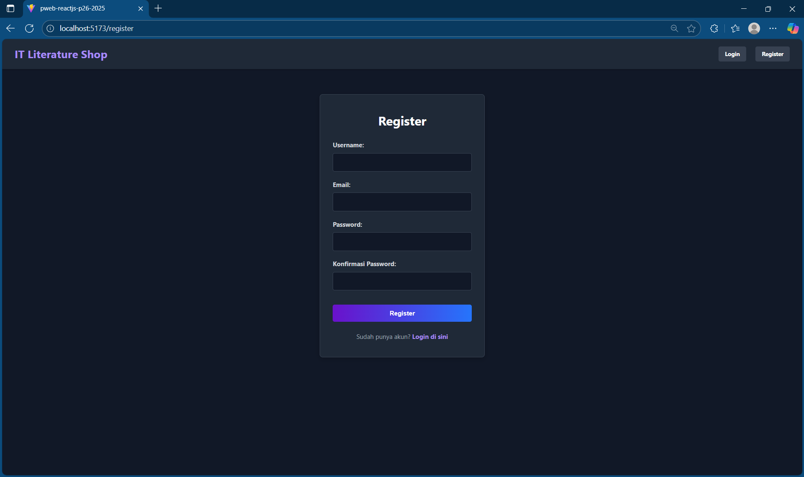

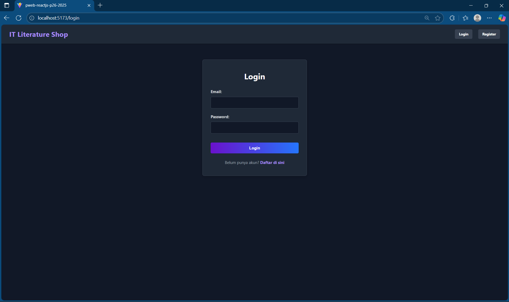

- Navbar Dinamis: Navbar akan berubah menggunakan conditional rendering. Pengguna yang belum login akan melihat tombol "Login" dan "Register". Pengguna yang sudah login akan melihat email mereka, tombol "Logout", dan link ke halaman terproteksi.

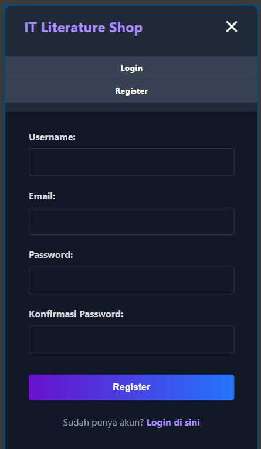

2. Katalog & Detail Buku

- Halaman Katalog (Homepage): Halaman utama yang menampilkan semua buku dalam layout grid yang responsif. Pengguna (termasuk tamu) dapat mencari, memfilter, dan menyortir buku.

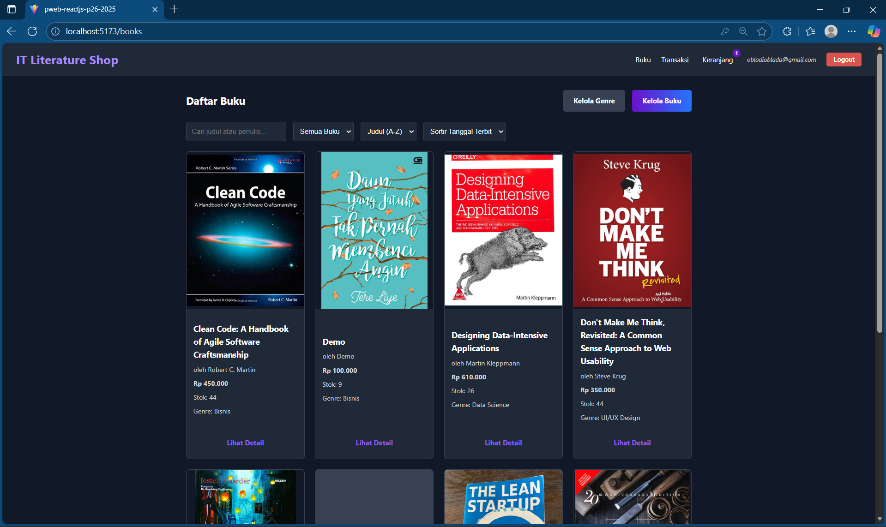

- Halaman Detail Buku: Halaman dinamis (/books/:id)  yang menampilkan informasi lengkap buku, termasuk gambar, deskripsi, stok, dan harga.

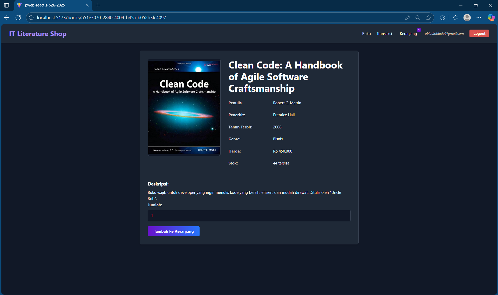

- Alur "Tambah ke Keranjang": Pengguna yang belum login akan melihat tombol "Login untuk Membeli". Pengguna yang sudah login dapat menambahkan buku ke keranjang, lengkap dengan input kuantitas.

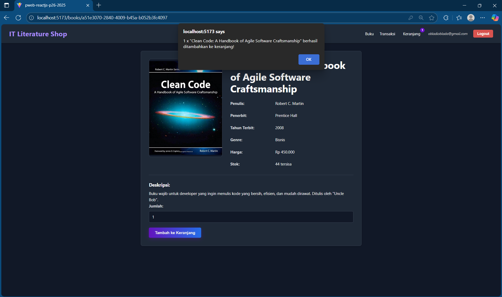

3. Manajemen & Admin

- Kelola Buku: Halaman yang menampilkan semua buku dalam tampilan daftar (list view) yang rapi. Dapat melihat tombol "Detail", "Edit", dan "Hapus" (soft delete)  untuk setiap buku.

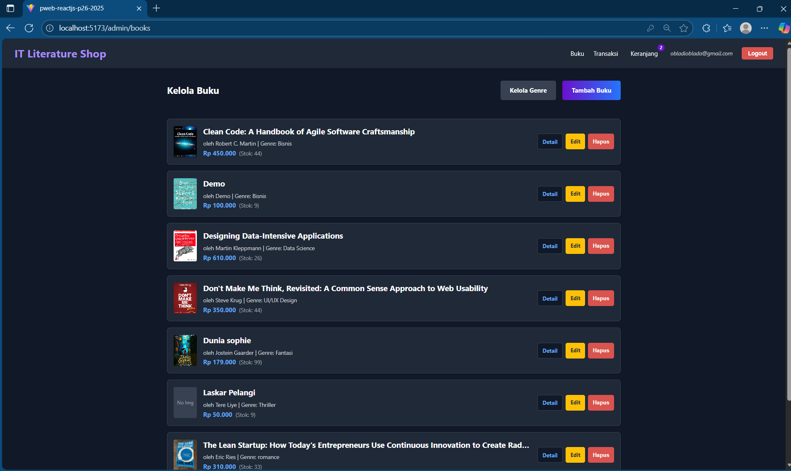

- Tambah Buku: Form admin untuk menambahkan buku baru, termasuk input untuk FormData (upload gambar opsional). Form ini memiliki validasi real-time untuk mencegah input negatif atau tidak valid.

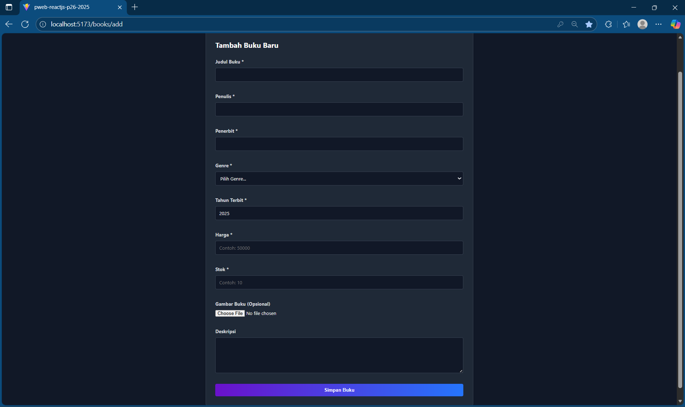

- Edit Buku: Form admin untuk memperbarui data buku yang sudah ada. Form ini mengambil data buku saat ini dan mengizinkan pembaruan parsial (hanya field yang diubah).


- Kelola Genre: Halaman admin (/genres) untuk melakukan operasi CRUD (Tambah, Edit, Hapus) pada genre buku.

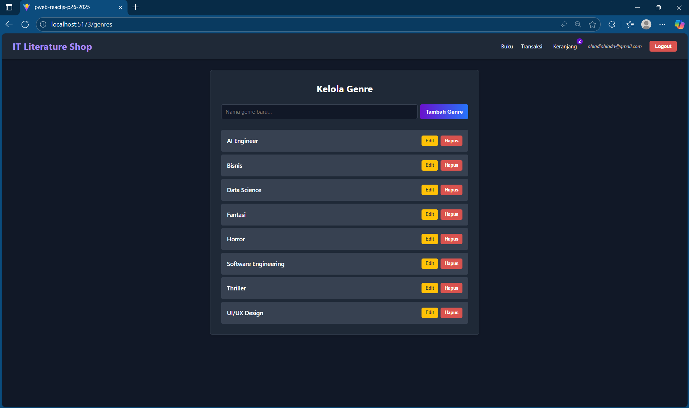

4. Alur Transaksi & Keranjang Belanja

- Keranjang Belanja: Halaman (/cart) yang mengambil item dari CartContext. Pengguna dapat menyesuaikan kuantitas atau menghapus item. Total belanja akan dihitung secara otomatis.

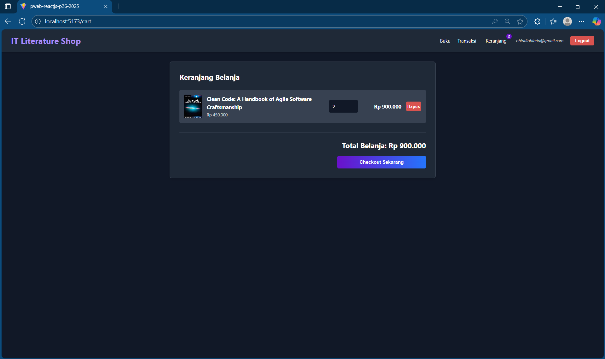

- Riwayat Transaksi: Halaman terproteksi (/transactions) yang menampilkan daftar semua transaksi yang telah dilakukan oleh pengguna, lengkap dengan tanggal, status, total harga, dan fitur filter. 

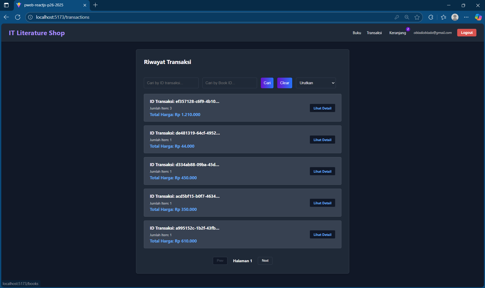

- Detail Transaksi: Halaman dinamis (/transactions/:id) yang menampilkan rincian lengkap dari satu transaksi, termasuk item yang dibeli dan bukti pembayaran yang di-upload. 

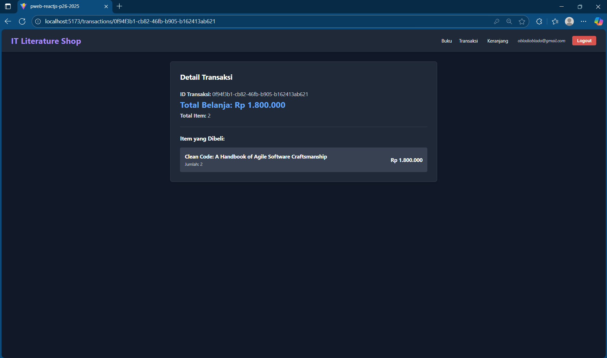